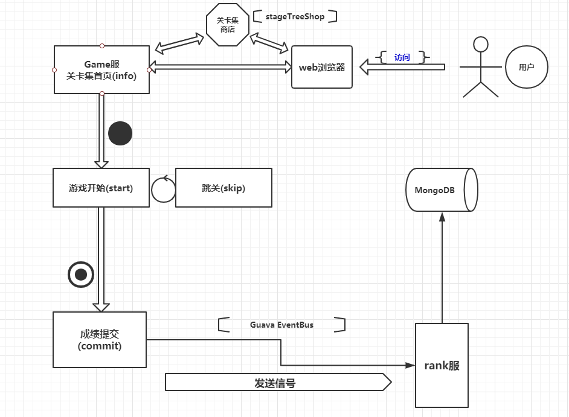

# 《方块消消乐》(Happy Elements)

~~~
 ____  ____                                   ________  __                                     _          
|_   ||   _|                                 |_   __  |[  |                                   / |_        
  | |__| |   ,--.  _ .--.   _ .--.   _   __    | |_ \_| | | .---.  _ .--..--.  .---.  _ .--. `| |-'.--.   
  |  __  |  `'_\ :[ '/'`\ \[ '/'`\ \[ \ [  ]   |  _| _  | |/ /__\\[ `.-. .-. |/ /__\\[ `.-. | | | ( (`\]  
 _| |  | |_ // | |,| \__/ | | \__/ | \ '/ /   _| |__/ | | || \__., | | | | | || \__., | | | | | |, `'.'.  
|____||____|\'-;__/| ;.__/  | ;.__/[\_:  /   |________|[___]'.__.'[___||__||__]'.__.'[___||__]\__/[\__) ) 
                  [__|     [__|     \__.'                                                                 

~~~

## 项目介绍

~~~
    Happy Elements(方块消消乐) ——一款仿开心消消乐的消除休闲游戏
    架构使用SpringBoot+Maven来搭建多进程框架，包括Login、Game、Res 三个服务器
~~~    

## 项目组织模块

~~~
Root project 'h5web-parent'
+--- Project ':h5web-common'
+--- Project ':h5web-util'
+--- Project ':h5web-game'
+--- Project ':h5web-rank'
\--- Project ':h5web-h5Res'
~~~

## 项目架构图

## 项目研发日志更新

* [项目研发进度](h5web-static/doc/h5web-static/progress.md)

## 快速开始

1. 使用git下载代码 git clone https://github.com/noseparte/h5web-parent.git;
2. 将代码导入带有gradle插件的IDE(推荐使用IntelliJ IDEA);
3. 保证本地安装Maven、mongodb等服务;
4. 启动Game服务端，入口为H5WebGameApplication类;
5. 启动Rank服务端，入口为H5WebRankApplication类;
5. 启动Res服务端，入口为H5ResApplication类;

## 一起交流

    如果您发现bug，或者有任何疑问，请提交issue !!
    或者加入QQ交流群：780465774

* [QQ群 670252084](https://jq.qq.com/?_wv=1027&k=5gXmfE2)

 (Chinese ver.) 持续更新中，保持关注。

    